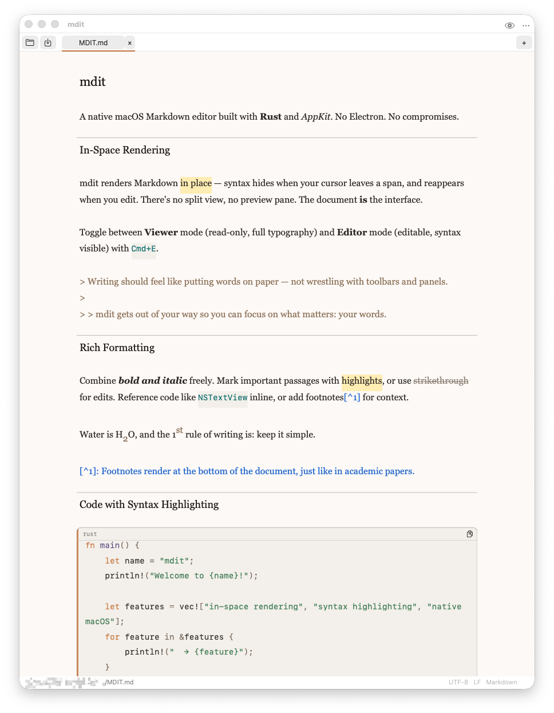
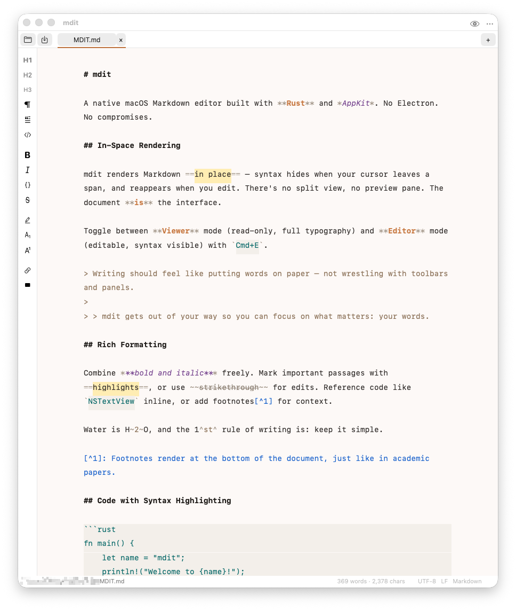

# mdit

A native macOS Markdown editor built with **Rust** and **AppKit**. No Electron. No compromise.



## Features

**In-Space Rendering** — Markdown syntax hides when your cursor leaves a span,
and reappears when you edit. No split view, no preview pane. The document is the interface.

**Dual Modes** — Toggle between **Viewer** mode (read-only, full typography) and
**Editor** mode (editable, syntax visible) with `Cmd+E`.



- Rich text rendering: headings, bold, italic, strikethrough, links, footnotes
- Fenced code blocks with syntax highlighting (powered by Syntect)
- Tables (GFM-style)
- Math/LaTeX rendering (inline and block, via KaTeX)
- Inline image rendering with paste-to-embed
- Find & Replace (`Cmd+F`)
- PDF export
- Light, Dark, and System appearance
- Configurable font size (`Cmd++` / `Cmd+-`)
- Tabs for multiple documents

## Installation

### Download

Download the latest `.dmg` from the [Releases](https://github.com/Soron2038/mdit/releases) page.
Open it, drag **mdit** to your Applications folder — done.

> **Requirements:** macOS 13.0 (Ventura) or later.

### Build from Source

```bash
git clone https://github.com/Soron2038/mdit.git
cd mdit
cargo build --release
```

The binary lands in `target/release/mdit`. To build a distributable `.app` bundle and DMG:

```bash
./scripts/build-dmg.sh
```

## Keyboard Shortcuts

| Action | Shortcut |
|---|---|
| Toggle Viewer/Editor | `Cmd+E` |
| Bold | `Cmd+B` |
| Italic | `Cmd+I` |
| Link | `Cmd+K` |
| Heading H1 / H2 / H3 | `Cmd+1` / `2` / `3` |
| Find & Replace | `Cmd+F` |
| Increase font size | `Cmd++` |
| Decrease font size | `Cmd+-` |
| New document | `Cmd+N` |
| Open | `Cmd+O` |
| Save | `Cmd+S` |
| PDF export | `Cmd+Shift+E` |
| Appearance toggle | `Cmd+Shift+L` |

## Built With

- **Rust** — no runtime, no garbage collector
- **AppKit** (via `objc2`) — native macOS, not a web wrapper
- **Comrak** — CommonMark + GFM Markdown parsing
- **Syntect** — TextMate-grammar syntax highlighting
- **KaTeX** — LaTeX math rendering

Ships as a ~5 MB app bundle.

## License

[MIT](LICENSE)
